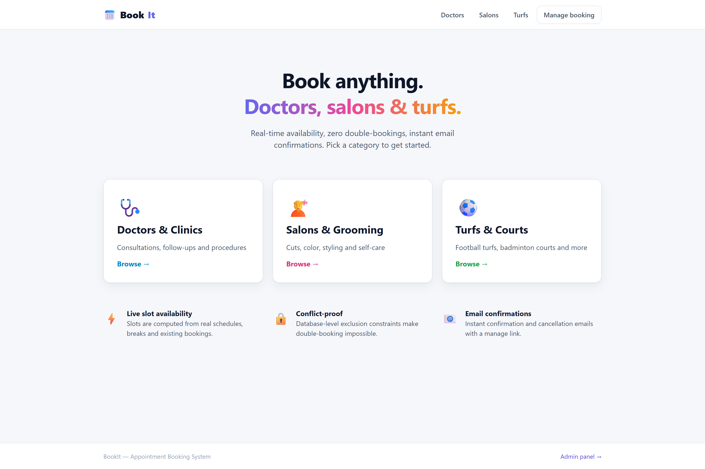
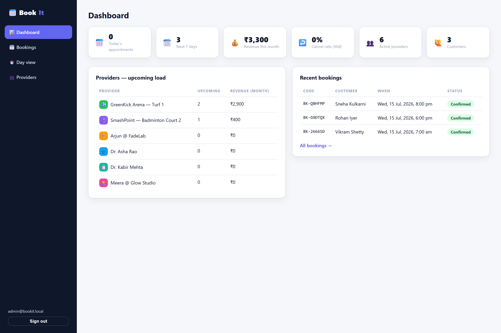
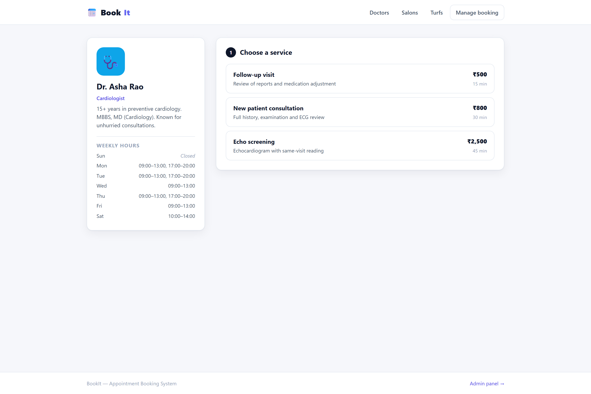
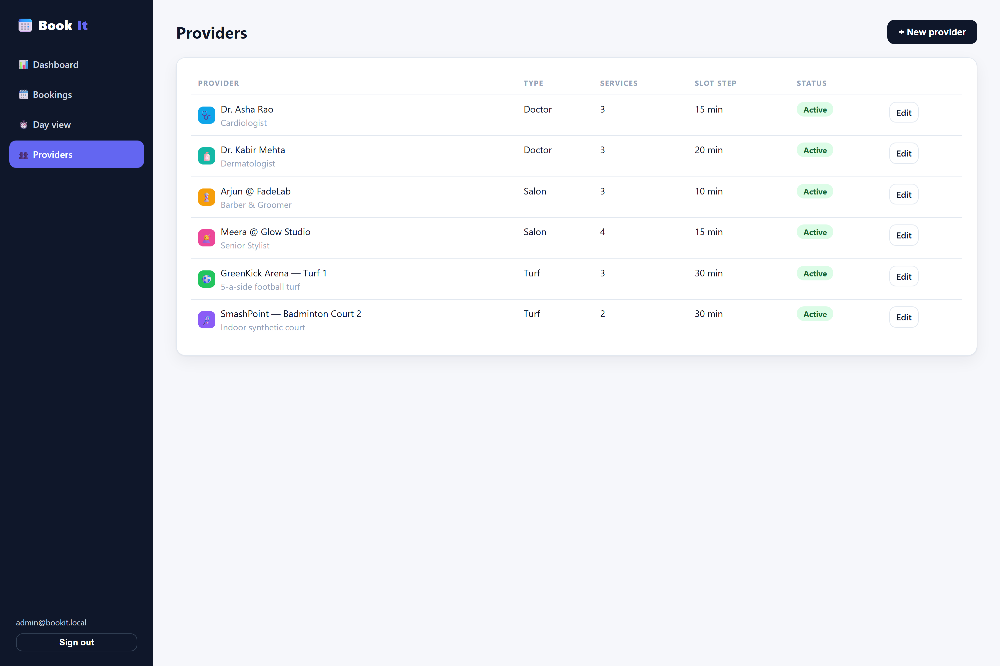
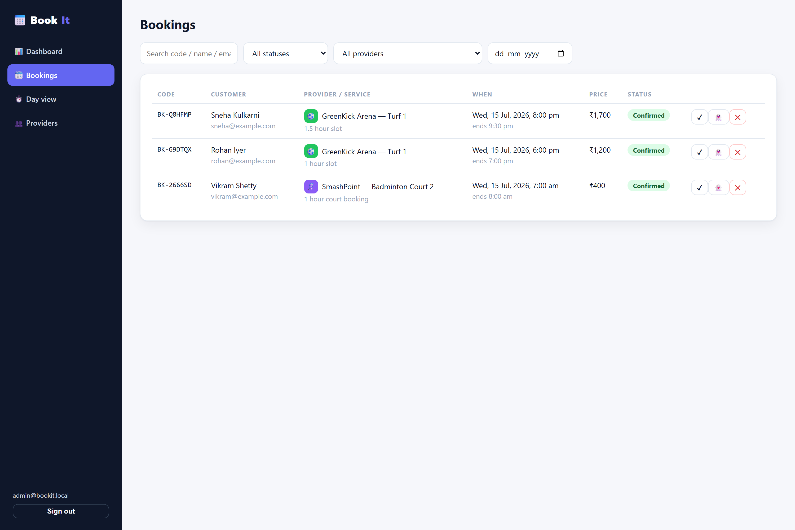
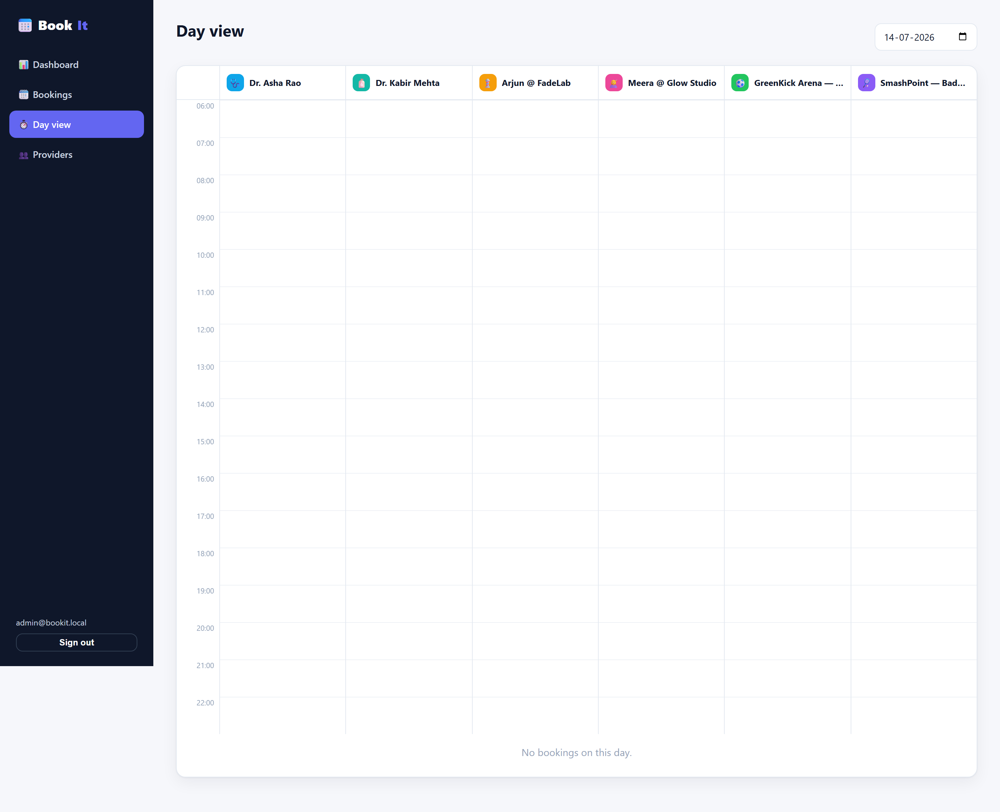
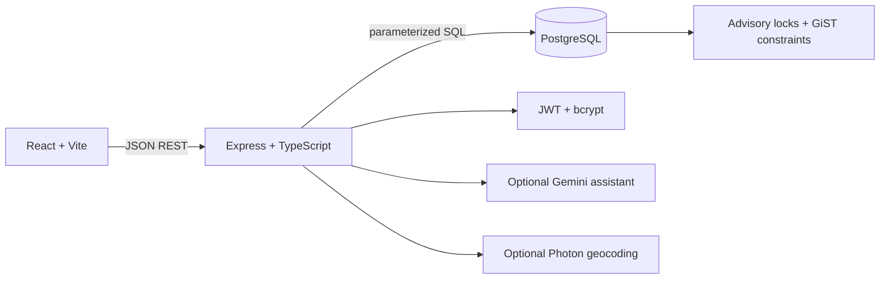

<div align="center">

# BookFlow

### AI-Assisted Conflict-Safe Resource Booking Platform

Find resources, understand live availability, and reserve time without allowing
concurrent requests to create overlapping bookings.

[](https://react.dev/)
[](https://www.typescriptlang.org/)
[](https://vitejs.dev/)
[](https://expressjs.com/)
[](https://www.postgresql.org/)
[](LICENSE)

</div>

## Overview

BookFlow is a full-stack, multi-tenant scheduling workspace for businesses
that manage bookable resources. A resource can be a room, sports court, staff
member, lab instrument, or any other capacity that needs a schedule.

Customers can browse resources, use the optional AI assistant, see ranked live
availability, place a five-minute hold, confirm or reschedule a booking, and
join a waitlist. Business owners manage isolated workspaces, locations,
resources, services, weekly schedules, time off, operations, notifications, and
CSV exports.

## Screenshots

### Customer workspace

The customer experience provides resource discovery, ranked recommendations,
AI-assisted search, protected holds, bookings, waitlists, and notifications.

<p align="center">
  
</p>

### Business operations dashboard

The admin workspace gives business owners an operational view of upcoming
bookings, resources, schedules, and customer activity.

<p align="center">
  
</p>

### Booking and resource management

<table>
  <tr>
    <td width="50%" align="center">
      <strong>Live booking flow</strong><br />
      <sub>Service, date, and availability selection with live slot calculation.</sub><br /><br />
      
    </td>
    <td width="50%" align="center">
      <strong>Resource management</strong><br />
      <sub>Business owners manage resources, services, schedules, and time off.</sub><br /><br />
      
    </td>
  </tr>
  <tr>
    <td width="50%" align="center">
      <strong>Booking operations</strong><br />
      <sub>Review, filter, and update booking status from the business workspace.</sub><br /><br />
      
    </td>
    <td width="50%" align="center">
      <strong>Day view</strong><br />
      <sub>See scheduled activity across resources for a selected day.</sub><br /><br />
      
    </td>
  </tr>
</table>

## What makes it special

### Three layers against double-booking

Two customers requesting the same slot at the same time cannot both win:

1. A PostgreSQL advisory transaction lock serializes attempts for one resource.
2. Availability is recomputed inside the booking transaction.
3. A PostgreSQL GiST exclusion constraint rejects overlapping active time ranges.

Different resources can still be booked concurrently. Preparation and cleanup
buffers are included in the protected range, while adjacent half-open ranges
remain bookable.

### AI that cannot bypass booking safety

The optional Gemini integration converts messages such as “a court tomorrow at
6 PM for an hour” into structured resource, service, date, time, and duration
preferences. Zod validates the response and the server verifies the result
against the real catalog.

The assistant only prepares search preferences. It cannot claim that a slot is
available or create, confirm, cancel, or reschedule a booking. The normal
transactional booking flow remains the only authority. Deterministic mock and
disabled fallbacks allow local development without an AI key.

## Features

### Customer experience

- Registration, login, profile, and booking history
- Resource catalog with services, locations, durations, prices, and schedules
- Ranked recommendations based on resource, service, date, time, flexibility, and demand
- Timezone-aware availability with breaks, time off, buffers, lead time, and booking horizon
- Five-minute holds, confirmation, cancellation, and version-checked rescheduling
- Waitlist requests with expiry-aware promotion after capacity is released
- In-app notifications and booking-event history

### Business workspace

- Organization and location management with tenant isolation
- Resource and service creation and editing
- Weekly schedule windows and dated time-off blocks
- Resource activation and operational booking status updates
- Notifications, utilization data, audit events, and CSV export
- Optional address suggestions through the Photon geocoding API

## Architecture



The active API is mounted at `/api/flow`. It uses raw parameterized SQL through
`pg` and Zod schemas at the request boundary. PostgreSQL also stores shared
rate-limit counters, so the running application does not depend on Redis.
Redis is included only as an optional Compose learning service.

## Technology

| Area | Tools |
| --- | --- |
| Frontend | React 18, TypeScript, Vite, React Router |
| Backend | Node.js, Express, TypeScript, REST APIs |
| Data | PostgreSQL, `pg`, raw parameterized SQL, migrations |
| Reliability | Advisory locks, GiST exclusion constraints, transactions |
| Validation and security | Zod, JWT, bcrypt, organization authorization |
| Optional integrations | Google Gemini, Photon geocoding |
| Operations | Docker Compose, npm workspaces, maintenance worker |

## Run locally

### Requirements

- Node.js 22 or newer
- Docker with Compose

### Setup

```bash
git clone https://github.com/goyalsgit/BookFlow-AI-Assisted-Conflict-Safe-Booking-Platform.git
cd BookFlow-AI-Assisted-Conflict-Safe-Booking-Platform
npm install
cp server/.env.example server/.env
docker compose up -d db
npm run db:setup
npm run dev
```

Open the client at `http://localhost:5175`. The API runs at
`http://localhost:4170`. Configure `AI_PROVIDER=gemini` and
`GEMINI_API_KEY` only when Gemini assistance is needed.

## Verification

```bash
npm run typecheck
npm run build
npm test
```

The integration suite uses a disposable PostgreSQL database. It covers 20-way
hold contention, direct SQL overlap rejection, buffers, hold expiry,
confirmation, cancellation, rescheduling, waitlist promotion, authorization,
organization isolation, resource setup, recommendations, and DST behavior.

## Scope notes

- Prices are informational in the active BookFlow flow; payment collection is not active.
- Notifications are in-app/local development outputs; production email/SMS delivery is not assumed.
- Redis is optional and is not used by the running application.
- The assistant provides preferences only and never performs booking actions.

## Documentation

- [Architecture and request flow](docs/ARCHITECTURE.md)
- [Verified flow and schema](docs/VERIFIED_FLOW_AND_SCHEMA.md)
- [Audit and known limitations](docs/AUDIT.md)
- [Interview guide](docs/INTERVIEW_GUIDE.md)
- [Scaling and Redis notes](docs/SCALING_AND_REDIS.md)

## Author

**Devansh Goyal**

[GitHub: goyalsgit](https://github.com/goyalsgit)

## License

This project is available under the [MIT License](LICENSE).