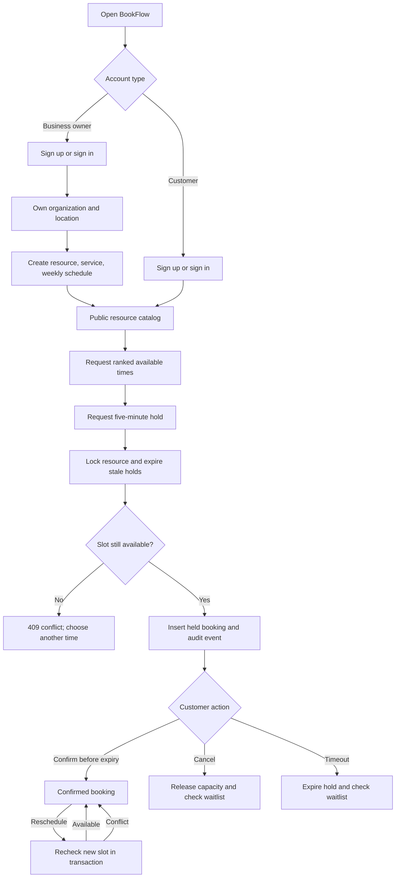
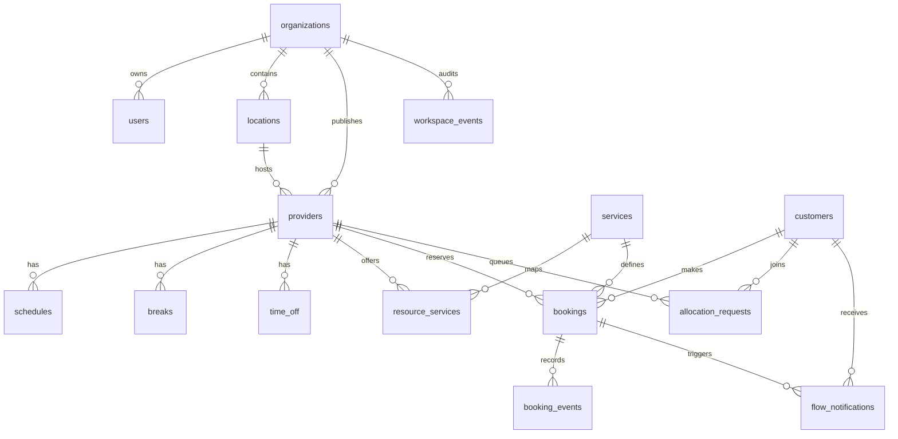

# BookFlow: verified control flow, sequence, and data model

This describes the **active `/api/flow` application**. The repository also contains older BookIt routes and tables that are not mounted by `server/src/app.ts`; they are outside this flow.

## Control flow



The ranked search is advisory. Availability is recomputed inside the hold transaction, so an old search result cannot force a booking. Time is interpreted in the resource organization's IANA timezone. Weekly windows, recurring breaks, one-off time off, preparation/cleanup buffers, active bookings, minimum lead time, and booking horizon all affect available slots.

## Sequence: two customers request the same slot

```mermaid
sequenceDiagram
    participant A as Customer A
    participant B as Customer B
    participant API as Express API
    participant DB as PostgreSQL
    A->>API: POST /api/flow/holds
    B->>API: POST /api/flow/holds (same resource/time)
    API->>DB: A BEGIN; lock resource
    API->>DB: B BEGIN; waits for resource lock
    API->>DB: A expire holds; recompute slots
    API->>DB: A INSERT held booking; audit; COMMIT
    DB-->>API: A hold created
    API-->>A: 201, five-minute hold
    DB-->>API: B acquires resource lock
    API->>DB: B recompute slots
    DB-->>API: Slot occupied
    API->>DB: B ROLLBACK
    API-->>B: 409 slot conflict
```

The active booking range is `[blocked_start, blocked_end)`. A database GiST exclusion constraint forbids overlap for the same resource, including preparation and cleanup buffers. It is the final guard if a caller bypasses the normal lock/check path. Adjacent ranges can meet at a boundary. The integration test sends 20 simultaneous requests for one slot: one succeeds and 19 return 409.

## Sequence: business publishes availability

```mermaid
sequenceDiagram
    participant Owner as Business owner
    participant UI as React UI
    participant API as Express API
    participant DB as PostgreSQL
    Owner->>UI: Create business account
    UI->>API: POST /api/flow/admin/register
    API->>DB: BEGIN; insert organization, location, user; COMMIT
    API-->>UI: Business JWT
    Owner->>UI: Add resource, service, weekly hours
    UI->>API: POST /api/flow/admin/resources
    API->>DB: Verify owner organization; insert resource, service, schedule in transaction
    API-->>UI: Resource created
    UI->>API: GET /api/flow/resources/:id/slots?serviceId&date
    API->>DB: Compute current slots from schedule and conflicts
    API-->>UI: Available times
```

## Active relational model



| Table | Active purpose | Key rule |
| --- | --- | --- |
| `organizations`, `users`, `locations` | Business tenancy and owners | Management queries scope by `organization_id` |
| `customers` | Customer identity/profile | Unique email; password hash; profile access by token subject |
| `providers`, `services`, `resource_services` | Resources and bookable sessions | Service must be mapped to resource |
| `schedules`, `breaks`, `time_off` | Weekly and one-off availability | Weekly windows cannot overlap |
| `bookings` | Holds and confirmed reservations | Exclusion constraint prevents active blocked-range overlap |
| `booking_events`, `workspace_events` | Change history | Written with business/booking operations |
| `allocation_requests`, `flow_notifications` | Waitlist and in-app notifications | Live waitlist request uniqueness and notification dedupe |
| `request_limits` | Shared API rate limits | PostgreSQL atomic upsert across API instances |

The baseline schema also creates legacy payment, coupon, loyalty, review, and favorite tables. They do not imply that those features are active in the BookFlow UI/API.

## ACID and conflict checks

- **Atomicity:** booking and business setup writes use transactions; on error they roll back together.
- **Consistency:** foreign keys, validation, schedule checks, service mapping, and the booking exclusion constraint enforce invariants.
- **Isolation:** per-resource advisory locks serialize booking attempts; row locks protect booking changes. This is targeted concurrency control, not a claim that every transaction runs at `SERIALIZABLE` isolation.
- **Durability:** PostgreSQL persists committed writes. Operational durability also depends on deployed storage and tested backups, which this repository does not prove.
- **Failure behavior:** an occupied slot returns 409; an expired hold cannot confirm; a failed reschedule keeps the old booking; a schedule change that would exclude an active reservation is rejected.

## Verified and still open

`npm test` exercises signup/roles/profile, 20-way hold contention, direct SQL overlap rejection, buffers, expiry, confirmation, cancellation, rescheduling, waitlist, schedule edits, and timezone edge cases. A passing local suite proves these tested paths, not production behavior under sustained traffic.

Sign out clears the browser session. JWTs are not revoked server-side before their expiry. Email verification, password recovery, deployment monitoring, backup/restore drills, and load testing remain open before calling the service production ready. Prices are informational in the active BookFlow app; do not claim payment processing on a resume.
